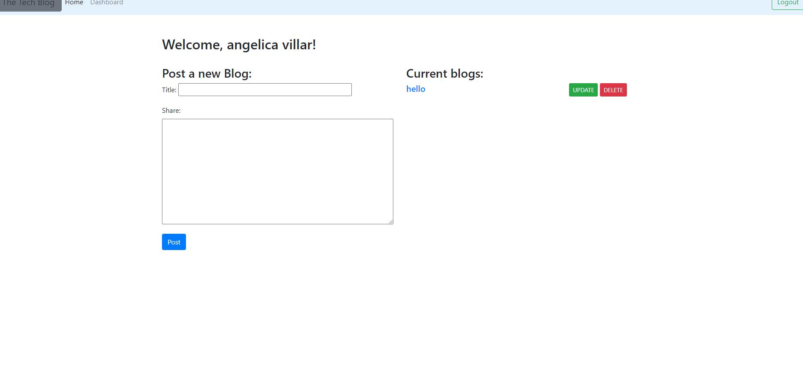

# techblog

# Description
The app allows client to signup and create a blog of posts, where they can delete and add new comments

# Table of contents
- Installation
- Usage
- APP link

# Installation
    npm i, to install all packagges

# Usage
- the app is intended to create several posts once logged in, it takes you to the blog page where you can add delete.

- APP Link

 

